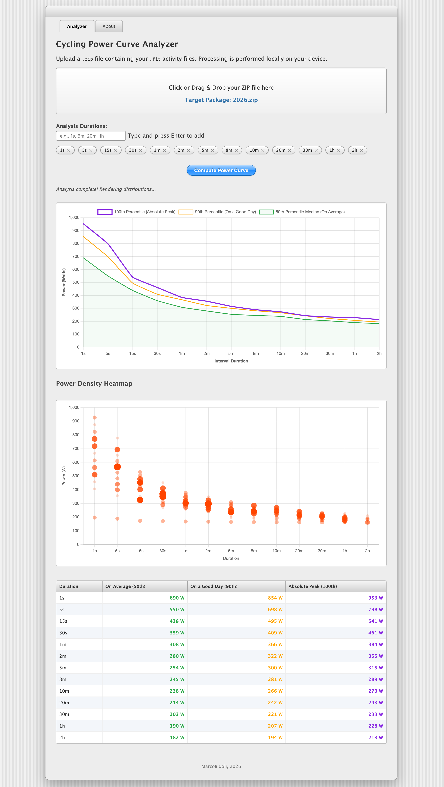

# Cycling Power Curve Analyzer

A web-based tool designed to help cyclists understand their power capabilities beyond just their absolute peaks.

 While standard power-duration curves show your all-time best efforts, this tool reveal what you can **consistently** and **repeatably** achieve on a typical day.

 

## Features

- **Local Processing:** All analysis is performed entirely in your browser. Your activity data never leaves your device, ensuring total privacy.
- **ZIP & FIT Support:** Upload a `.zip` archive containing your `.fit` activity files (exported from platforms like Intervals.icu, Garmin, etc.).
- **Customizable Durations:** Analyze performance across any time interval (e.g., 1s, 5s, 1m, 20m, 1h).
- **Percentile Analysis:**
    - **100th Percentile:** Your absolute peak power (the traditional curve).
    - **90th Percentile:** What you can do "on a good day."
    - **50th Percentile (Median):** Your typical, repeatable performance.
- **Power Density Heatmap:** Visualize the distribution of your efforts to see where you spend most of your time for each duration.

## How to Use

1. **Export your data:** Download your activity history as a ZIP file (e.g., from [Intervals.icu](https://intervals.icu/)).
2. **Upload:** Drag and drop the ZIP file into the analyzer.
3. **Configure:** Add or remove the durations you want to analyze.
4. **Compute:** Click "Compute Power Curve" and wait for the local analysis to complete.
5. **Analyze:** Explore the Power Curve chart, the Heatmap, and the detailed percentile table.

## Tech Stack

- **Frontend:** Vanilla HTML5, CSS3, and JavaScript.
- **Charts:** [Chart.js](https://www.chartjs.org/) for interactive visualizations.
- **Compression:** [fflate](https://github.com/101arrowz/fflate) for high-performance, in-browser ZIP extraction.
- **Data Parsing:** Custom-built native binary FIT stream interpreter.

---

Created by **MarcoBidoli**, 2026.

*Developed with the assistance of **Gemini 3 Flash**.*
